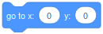
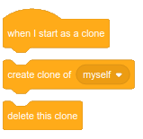

# PScratch-lib-0.9.1

PScratch is a package for processing that give the possibility to use basic scratch function for learning processing

#### Initialization
For start (in futur this will be an importable library), you have ton download PScratch released and use the folling code for starting

```java
Cat cat;                         // create a new sprite
Scene scene;                     // create the scene                         // create a new sprite
void setup() {                   // --- when program starts (like green flag)
  size(800, 600);                // screen size
  scene = new Scene("scenes");   // initialize the scene
  soundFolder("sounds");         // loadSounds into soundsFolder (can be renamed)
  //-----initialize sprites-----------
  cat= new Cat();
}                                // ------end of starting program ------
void draw () {                   //-----forever at 60 fps-----
  scene.backdrops();             // display the backdrops of the scene
  pickColor();
  cat.draw();                    // display a sprite can be also cat.display
}                                //----end of draw -----
void keyPressed() {              // called when a key is pressed
  keyIsDown();                   // check if all keys are pressed or not
}
void keyReleased() {             // called when a key is released
  keyIsUp();                     // check if all keys are released or not
}

class Cat extends Sprite {           // create the sprite instance named "Cat"
  Cat() {
    super();                         //call sprite functions
    start();                         // launch thread run, independent from draw
    spriteFolder("cat");             // look into sprite folder and import image, each sprite MSUT have its own folder named
  }
  void draw() {                      // call it into the main draw void or just call sprite.display into main draw void
    display();                       // for showing and using the sprite
  }
  void run() {                       // thread where you can code without screen frameRate
  }
}
```

### Motion

| Scratch___________________________ | Processing | Description|
| :---  | :--- | :--- |
| | `move(10);` | how many pixels the sprite move in the current direction|
|  | `turnLeft(15);` | how many degrees the sprite is rotation to the left |
|  | `turnRight(15);` | how many degrees the sprite is rotation to the right |
|  | `goTo(0, 0); goTo("mouse"); goTo("randomPosition"); goTo(Sprite);` | Place the sprite somewhere : Can be coordinates x and Y, an other sprite, a random position in the screen or to the mouse |
|  | `glide(1, 0, 0); glide(1, "mouse"); glide(1, "randomPosition"); glide(1, Sprite);` | The sprite will move during 1 second somewhere : Can be coordinates x and Y, an other sprite, a random position in the screen or to the mouse (it might not be call in draw void)|
|  | `pointInDirection(0);` | Orienting the sprite in a direction in degrees. 0 is the default orientation |
|  | `pointTowards(0,0); pointTowards("mouse"); pointTowards(Sprite);` | Orienting the sprite towars a : coordinates x and Y, an other sprite, a random position in the screen or to the mouse |
|  | `changeXBy(10);` | Change the coodonate X of the sprite in pixel |
|  | `setXTo(0);` | Set the coodonate X of the sprite in pixel |
|  | `changeYBy(10);` | Change the coodonate Y of the sprite in pixel |
|  | `setYTo(0);` | Set the coodonate Y of the sprite in pixel |
|  | `onEdgeBounce();` | If the sprite touch the edge, it will automatically turn in the oposite direction |
|  | `x` | Return the current coordinate X of the sprite |
|  | `y` | Return the current coordinate Y of the sprite |
|  | `direction` | Return the current direction of the sprite |
|  | `setRotationStyle("left-right"); setRotationStyle("don't rotate"); setRotationStyle("all around");` | Change the style of the rotation of the sprite, "left-right" the sprite will move like mirror, "don't rotate" the sprite will no be visualy affected by the orientation and "all around" is the defaut 360° rotation. This is purelly visual and don't affect the mouvements of the sprite |


### Looks

| Scratch | Processing | Description |
| :--- | :--- | :--- |
|  | `say("Hellow"); say("Hellow", 2);` | Display a dialog bubble to the sprite with a text, it's possible to display during a defined time in second (in this case it might not be call in draw void) |
|  | `think("Hellow"); think("Hellow", 2);` | Display a thinking bubble to the sprite with a text, it's possible to display during a defined time in second (in this case it might not be call in draw void) |
|  | `switchCostumeTo(1);` | Change the sprite costume to a specified costume number |
|  | `nextCostume()` | Change the costume of the sprite to the next costume in the costumes list |
|  | `stage.switchBackdropTo(1);` | Change the stage backdrop to a specified backdrop number |
|  | `stage.nextBackdrop();` | Change the stage backdrop to the next backdrop in the backdrops list |
|  | `changeSizeBy(25);` | Change the size of the sprite to a bigger or , with negativ numbers to a smaller size. In case of BIG size, it's better to resize the image with `resize()` function or a image edition software. |
|  | `setSizeTo(25);` | Set the size of the sprite in purcent. In case of BIG size, it's better to resize the image with `resize()` function or a image edition software. |
|  | `changeColorEffectBy(25);` | Change all the color of the sprite to another, each 100 the color will reset from the start |
|  | `setColorEffectTo(0);` | Set all the color of the sprite to another, 0 to 100 |
|  | `changeGhostEffectBy(25);` | Add transparency to the sprite at 255 it will be totally invisible |
|  | `setGhostEffectTo(10);`  | Set the transparency to the sprite at 255 it will be totally invisible |
|  | `clearGraphicEffects();` | Cancel all the graphics effects like color and ghost |
|  | `show();` | Show the sprite and can be detected and can detect other things |
|  | `hide();` | Hide the sprite and can't be detected and can't detect other things |
|  | `costume` | Return the current costume of the sprite |
|  | `stage.backdrop` | Return the current backdrop of the stage |
|  | `spriteSize` `spriteWidth` `spriteHeight` | Return the size or the width or the height of the sprite |


### Sounds

| Scratch___________________________  | Processing | Description |
| :--- | :--- | :--- |
|  | `playSoundUntilDown(0);` | Play a sound and wait until is finished. It should be call inside run() function |
|  | `playSound(0);` | Play a sound. If the sound is called again it will stop, rewind and play it again |
|  | `stopAllSound();` `stopSound(0);` | Stop all sound, stop a specific sound |
|  | `changePitchEffectBy(100);` `changePanEffectBy(0);`| Change the pitch effect to positive or negative. Change the left-right panning of a sound (Only work with monophonics sounds) |
|  | `setPitchEffectBy(10);``setPanEffectBy(0);` | Set the value of the pitch or the pan effect |
|  | `clearSoundEffects();` | Set default value to all sound effect |
|  | `changeVolumeBy(-10);` | Change the volume of the sounds |
|  | `setVolumeTo(100);` | Set value to the volume of the sounds |
|  | `volume;` | return value of the volume of the sounds |


### Control

| Scratch___________________________  | Processing | Description |
| :--- | :--- | :--- |
|  | `wait(1);` | Stop the code during seconds. It should be call inside `run()` function or it will block the frameRate |
|  | `for(int i = 0; i < 10; i++){//code goes here});` | Repeat the code inside few time. `In draw()` void, it will wait the end of the repetition before go to the next frame. In `run()` void, it will repeat independently of the framerate  |
|  | `for(;;){//code goes here}` | Work as the repeat 10 time but indefinitly |
|  | `if(//condition){//code goes here}`| Execute the code inside the if, if the condition is complete |
|  | `if(//condition){//code goes here}`| Execute the code inside the `if`, if the condition is complete. If the condition is not complete, it will execute the code inside `else`. |
|  | `while(//condition){//code goes here}` | Wait or repeat until condition is done. It should be call inside `run()` function |
|  | `stop(); exit()` | Stop the code, quit the program |
|  | ` ArrayList<SpriteClass> SpriteClassArray = new ArrayList<SpriteClass>();` <br><br>  `SpriteClassArray.add(new SpriteClass());` <br><br>  `for (int i = SpriteClassArray.size() - 1; i >= 0; i--) { }` <br><br>  `SpriteClass SpriteClassInstance = SpriteClassArray.get(i);` <br><br>  `SpriteClassInstance.draw();` | The array that contains the class to clone <br><br><br>   Add a new class instance in the ArrayList <br><br>   Iterate for each clones <br><br><br>    Get the current clone instance <br><br><br>   Display each clone | 
     

### Sensing

| Scratch___________________________  | Processing | Description |
| :--- | :--- | :--- |
|  | `touch(color); touch(Sprite); touch(x,y,l,h); touch("mouse");touch("edge");` | Return true if the sprite is detecting a color, another sprite, coordinates with a rectangle hitbox, the mouse or the edge of the screen. Should use inside a `if` condition. |
|  | `distanceTo("mouse"); distanceTo(Sprite); distanceTo(x, y);` | Return the distance between the center of the sprite and the mouse, a sprite or coordinates |
|  | `ask("Question ?");`  | The sprite will ask to the user a key typed question to the user. |
|  | `answer`  | Return the answer of the ask function |
|  | `keyIsPressed('a'), keyIsPressed("upArrow")`  | Return true if the named key is pressed. For the arrows, it have to be a string `upArrow, leftArrow, downArrow, rightArrow`. |
|  | `mousePressed` | Return true if the mouse is pressed. It should be called inside a `if` |
|  | `mouseX` | Return the x position of the mouse on the screen |
|  | `mouseY` | Return the y position of the mouse on the screen |
|  | `setDragMode(true);` | Allow user to click and move the sprite with the mouse |
|  | `loudness` | Return the volume of the microphone 0 - 100 |
|  | `timer` | Return the time in sec since programme starts ou being reset|
|  | `resetTimer();` | Reset timer to 0|
|  | `year();`,`month();`, `day();`, `hour();`, `minute();`, `second();`, `millis();` | Return the current year, month, day... |


### PEN

| Scratch___________________________  | Processing | Description |
| :--- | :--- | :--- |
|  | `attach(Sprite);` | Attach the pen to a sprite and follow him |
|  | `eraseAll();` | Erase all stamp and all pen trace |
|  | `stamp();` | Make a stamp from the attached sprite |
|  | `penDown();` | Allow drawing |
|  | `penUp();` | Disable drawing |
|  | `changePenColorBy(1);` | Change the color to next color |
|  | `setPenColorTo(10);` | Set the color of the pen 0-100 |
|  | `changePenTransparencyBy(1);` | change the transparency of the pen |
|  | `setPenTransparencyTo(50);` | set the transparency of the pen |
|  | `changePenSizeBy(1);` | change the size of the pen |
|  | `setPenSizeTo(50);` | set the size of the pen |
